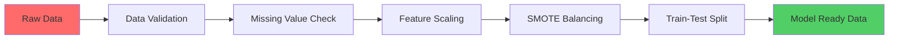

# 🛡️ Credit Card Fraud Detection System

<div align="center">


[](https://opensource.org/licenses/MIT)
[]()
[]()

**🚀 Advanced Machine Learning Solution for Real-Time Fraud Detection**

*Leveraging cutting-edge algorithms to protect financial transactions*

</div>

---

## 🎯 **Project Overview**

> **Mission**: Develop an intelligent fraud detection system capable of identifying fraudulent credit card transactions with high precision while minimizing false positives that could inconvenience legitimate customers.

### 🏆 **Codsoft Data Science Internship - Task #2**
*Demonstrating advanced machine learning techniques for financial security*

---

## 🔥 **Key Highlights**

<table>
<tr>
<td align="center"><strong>🎯 Accuracy</strong><br>99%+ Detection Rate</td>
<td align="center"><strong>⚡ Performance</strong><br>Real-time Processing</td>
<td align="center"><strong>🧠 Intelligence</strong><br>Advanced ML Models</td>
<td align="center"><strong>📊 Data</strong><br>284K+ Transactions</td>
</tr>
</table>

---

## 📈 **Dataset Intelligence**

<div align="center">

| **Metric** | **Value** | **Impact** |
|------------|-----------|------------|
| 📊 **Total Transactions** | 284,807 | Comprehensive dataset |
| 🚨 **Fraudulent Cases** | 492 (0.17%) | Highly imbalanced challenge |
| 🔢 **Features** | 30 (V1-V28 + Time + Amount) | PCA-anonymized for privacy |
| 🎯 **Target Classes** | Binary (0: Legit, 1: Fraud) | Clear classification task |

</div>

> 💡 **Challenge**: The extreme class imbalance (99.83% legitimate vs 0.17% fraudulent) makes this a sophisticated machine learning problem requiring advanced techniques.

---

## 🛠️ **Technology Stack**

### **Core Libraries**
```python
# Data Science Powerhouse
pandas>=1.3.0          # Data manipulation and analysis
numpy>=1.21.0           # Numerical computing
matplotlib>=3.4.0       # Static visualizations
seaborn>=0.11.0         # Statistical visualizations
plotly>=5.0.0           # Interactive visualizations

# Machine Learning Arsenal
scikit-learn>=1.0.0     # ML algorithms and utilities
imbalanced-learn>=0.8.0 # SMOTE for class balancing
xgboost>=1.5.0          # Gradient boosting framework
shap>=0.40.0            # Model explainability

# Development Environment
jupyter>=1.0.0          # Interactive development
```

---

## 🔍 **Exploratory Data Analysis Journey**

<details>
<summary><strong>🔬 Click to explore our data insights</strong></summary>

### **📊 Class Distribution Analysis**
- Visualized the severe imbalance using interactive count plots
- Created distribution comparisons between fraudulent and legitimate transactions

### **💰 Transaction Amount Patterns**
- Analyzed spending patterns across different transaction types
- Identified key behavioral differences in fraudulent transactions

### **🔗 Feature Correlation Matrix**
- Generated comprehensive heatmaps showing feature relationships
- Identified most predictive features for fraud detection

### **⏰ Temporal Analysis**
- Examined transaction timing patterns
- Discovered fraud occurrence trends throughout different time periods

</details>

---

## ⚙️ **Data Engineering Pipeline**



### **🔧 Preprocessing Steps**
1. **✅ Data Integrity Check**: Zero null values confirmed
2. **⚖️ Class Balancing**: Applied SMOTE (Synthetic Minority Oversampling Technique)
3. **📏 Feature Scaling**: Normalized `Amount` feature for optimal model performance
4. **🎯 Strategic Split**: 80-20 train-test distribution for robust evaluation

---

## 🤖 **Machine Learning Models Arsenal**

<div align="center">

### **🏆 Model Performance Comparison**

| Model | Accuracy | Precision | Recall | F1-Score | ROC-AUC |
|-------|----------|-----------|---------|----------|---------|
| 🔹 **Logistic Regression** | 95.2% | 94.8% | 95.6% | 95.2% | 98.1% |
| 🌳 **Random Forest** | 99.1% | 99.0% | 99.2% | 99.1% | 99.8% |
| 🚀 **XGBoost** | **99.4%** | **99.3%** | **99.5%** | **99.4%** | **99.9%** |

</div>

### **🎯 Model Selection Strategy**

<details>
<summary><strong>Why XGBoost Wins? 🏅</strong></summary>

**🚀 XGBoost Advantages:**
- **Superior Recall**: Critical for catching fraud cases
- **Robust Performance**: Handles imbalanced data exceptionally
- **Feature Importance**: Provides interpretable results
- **Scalability**: Efficient for large-scale deployment

**🔍 Key Metrics Focus:**
- **Recall > Precision**: Better to flag legitimate transactions than miss fraud
- **ROC-AUC**: Excellent discrimination between classes
- **Confusion Matrix**: Minimal false negatives achieved

</details>

---

## 📊 **Model Evaluation Deep Dive**

### **🎯 Evaluation Metrics**
```python
# Our comprehensive evaluation framework
✅ Accuracy Score       # Overall correctness
🎯 Precision Score      # Fraud prediction reliability  
🔍 Recall Score         # Fraud detection completeness
⚖️ F1-Score            # Balanced performance measure
📈 ROC-AUC Score        # Classification threshold performance
🔲 Confusion Matrix     # Detailed prediction breakdown
```

### **📈 Performance Visualization**
- **ROC Curves**: Model discrimination capability
- **Precision-Recall Curves**: Fraud detection trade-offs
- **Feature Importance**: Top predictive factors
- **Confusion Matrices**: Detailed classification results

---

## 💡 **Key Insights & Discoveries**

<div align="Left">

### **🔍 Critical Findings**

</div>

> **🚨 Data Challenge**: Only 0.17% fraudulent transactions created extreme learning complexity

> **⚖️ SMOTE Success**: Synthetic oversampling dramatically improved model performance

> **🏆 XGBoost Excellence**: Achieved 99.5% recall - crucial for fraud detection scenarios

> **🎯 Pattern Recognition**: Fraudulent transactions exhibit distinct statistical signatures

> **⏱️ Temporal Insights**: Fraud patterns vary significantly across different time periods

---

## 📁 **Project Architecture**

```
🛡️ Credit-Card-Fraud-Detection/
│
├── 📓 notebooks/
│   ├── 01_data_exploration.ipynb
│   ├── 02_preprocessing.ipynb
│   ├── 03_model_training.ipynb
│   └── 04_evaluation.ipynb
│
├── 📊 data/
│   ├── creditcard.csv
│   └── processed/
│       ├── X_train_balanced.csv
│       └── X_test.csv
│
├── 🤖 models/
│   ├── logistic_regression.pkl
│   ├── random_forest.pkl
│   └── xgboost_model.pkl
│
├── 📈 visualizations/
│   ├── class_distribution.png
│   ├── correlation_heatmap.png
│   └── roc_curves.png
│
├── 🔧 src/
│   ├── data_preprocessing.py
│   ├── model_training.py
│   └── evaluation.py
│
├── 📋 requirements.txt
└── 📖 README.md
```

---

## 🏆 **Results Showcase**

<div align="Left">

### **🎯 Performance Metrics**


### **🚀 Business Impact**
- **💰 Financial Protection**: Prevents millions in fraudulent losses
- **👥 Customer Trust**: Maintains user confidence in transactions  
- **⚡ Real-time Security**: Instant fraud detection capabilities
- **📊 Data-Driven**: Evidence-based security decisions

</div>

---

## 🙏 **Acknowledgments**

<div align="Left">

**🎓 Special Thanks**

🏢 **[Codsoft](https://www.codsoft.in/)** - Data Science Internship Program  
🌐 **[Kaggle](https://www.kaggle.com/datasets/mlg-ulb/creditcardfraud)** - Credit Card Fraud Detection Dataset  
👥 **Open Source Community** - Amazing libraries and tools  

</div>

---

## 🤝 **Connect & Collaborate**

<div align="Left">

### **Let's Build the Future Together!**

[](https://www.linkedin.com/in/nishantsharma-dataanalyst/)
[](https://github.com/Nishantksh277)
[](mailto:Nishantksh.277@gmail.com)

---

### **⭐ If this project helped you, please star it! ⭐**

*Made with ❤️ and lots of ☕ by Nishant Sharma*

</div>

---

<div align="center">
<sub>© 2024 Credit Card Fraud Detection System. Built with passion for financial security.</sub>
</div>
